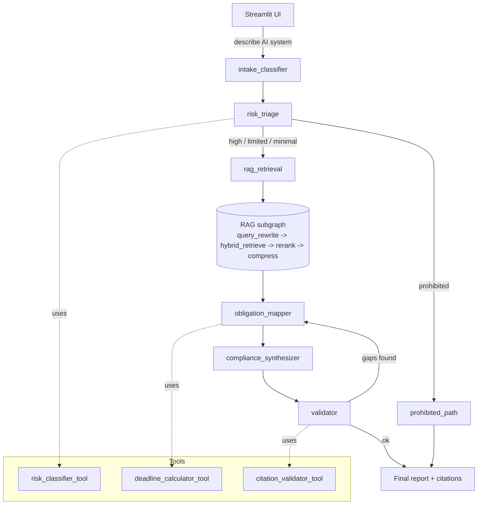

# RegPilot — Agentic RAG Compliance Navigator for the EU AI Act

[](https://github.com/Gyurmatag/regpilot-ai-act/actions/workflows/ci.yml)
[](https://www.python.org/downloads/)
[](LICENSE)
[](https://github.com/astral-sh/ruff)
[](http://mypy-lang.org/)

Tell RegPilot what your AI system does. It classifies the system against the four
risk tiers of the **EU AI Act** (Regulation (EU) 2024/1689), retrieves the
applicable Articles, computes the concrete compliance deadlines from Article 113,
and emits a roadmap with footnoted citations — all locally, no paid APIs.

Built end-to-end with **LangGraph** (agentic workflow + a modular RAG subgraph),
**Ollama** for the local LLM (`qwen2.5:3b-instruct`) and embeddings
(`nomic-embed-text`), **ChromaDB** + **BM25** for hybrid retrieval, and
**Streamlit** for the UI. The whole stack comes up with one command:

```bash
docker compose up --build
# → http://localhost:8501
```


> *Above: a CV-screening AI classified as `HIGH RISK` (Annex III: employment).
> The right panel shows the six agent nodes that fired and the obligation table
> the deadline calculator produced.*

## Table of contents

1. [Problem & justification](#1-problem--justification)
2. [Architecture](#2-architecture)
3. [Repo layout](#3-repo-layout)
4. [Install & run](#4-install--run)
5. [Functional evaluation](#5-functional-evaluation)
6. [Load test](#6-load-test)
7. [Tests & CI](#7-tests--ci)
8. [Limitations & next steps](#8-limitations--next-steps)

---

## 1. Problem & justification

> *"Is my AI system in scope of the EU AI Act, what risk tier does it fall under,
> what obligations apply, and by when do I have to comply?"*

This is the single question every PwC consulting team, in-house counsel and AI
product manager in the EU is asking right now in 2026. The Act entered into force
on 1 August 2024 and is rolling out in four phased application dates between
February 2025 and August 2027, so the answer is also a moving target. RegPilot
exists to give a fast, well-cited *first-pass* triage — not legal advice, but a
defensible starting point for the conversation that follows.

**Why this problem is relevant.** The AI Act is the world's first horizontal AI
regulation; non-compliance penalties reach EUR 35 m or 7% of global turnover
(Art. 99). Article 5 prohibitions (e.g. social scoring) have been in force since
2 Feb 2025 and the bulk of high-risk obligations kick in on 2 Aug 2026 — the
window for *getting ready* is shrinking, not opening.

**Why agentic RAG specifically.** The reasoning flow has natural branching
("prohibited" short-circuits to the ban notice; everything else goes through the
RAG → obligation-mapping → synthesis chain) and combines pure retrieval with
*non-retrieval* tools (a rule-based risk classifier and a deterministic
date calculator) that a plain RAG pipeline can't express cleanly. A
**self-critique loop** — the validator checks every cited Article against the
indexed Act and sends the draft back to the obligation mapper if any citation is
fabricated — closes the hallucination gap that traditional RAG leaves open.

**Why open-source / local.** The brief disallows paid APIs. Ollama with
`qwen2.5:3b-instruct` (~2 GB on disk, runs on CPU) is the sweet spot of
quality-vs-resource for this task: structured-output prompts and short Markdown
synthesis don't benefit much from a frontier model. A deterministic `StubClient`
is shipped alongside as a fallback so unit tests, CI and reviewers without
Ollama can still exercise the whole graph end-to-end.

---

## 2. Architecture



### Main LangGraph workflow — 6 nodes

| # | Node | Responsibility |
|---|---|---|
| 1 | `intake_classifier` | Free-text user input → structured `StructuredIntake` (purpose, deployment context, modalities, user role, domain). |
| 2 | `risk_triage` | **Conditional router.** Calls `risk_classifier_tool`; routes prohibited → `prohibited_path`, everything else → `rag_retrieval`. |
| 3 | `rag_retrieval` | Wrapper that **invokes the RAG subgraph**. |
| 4 | `obligation_mapper` | Maps risk tier + structured intake + retrieved Articles into a concrete obligation list via `deadline_calculator_tool` (Art. 113 phased dates). |
| 5 | `compliance_synthesizer` | LLM-driven Markdown report draft with inline `Art. N` citations. |
| 6 | `validator` | Self-critique. Calls `citation_validator_tool`; loops back to `obligation_mapper` (bounded by `max_validator_loops=2`) if citations are unsupported or missing. |

### RAG subgraph — 4 nodes (separate, modular, callable from the main graph)

| # | Node | What it does |
|---|---|---|
| 1 | `query_rewrite` | HyDE-style: generates 1–2 paraphrases tuned to the Act's formal language. |
| 2 | `hybrid_retrieve` | BM25 (`rank_bm25`) + dense (Chroma + `nomic-embed-text`), fused with **Reciprocal Rank Fusion** (`k=60`). |
| 3 | `rerank` | LLM-as-reranker prunes the fused list to top-5. |
| 4 | `compress` | Extractive: keep the 3 sentences per chunk with highest query-term overlap, to fit context. |

### Tools — 3 (≥2 required, ≥1 non-retrieval — all three are non-retrieval)

* **`risk_classifier_tool`** — Two-layer hybrid. (a) deterministic keyword + regex scan against Annex III + Article 5 keyword tables (`src/regpilot/ingestion/annex.py`); (b) LLM fallback only when no rule matches. Returns `(tier, rationale, annex_iii_matches, article_5_matches, confidence)`.
* **`deadline_calculator_tool`** — Pure-Python. Maps `(system_type, user_role)` to the chronological obligations list with the right Art. 113 phased dates (`2025-02-02 / 2025-08-02 / 2026-08-02 / 2027-08-02`). Deterministic, instantly unit-testable.
* **`citation_validator_tool`** — Scans the draft for `Art. N` / `Article N` patterns and verifies each cited Article exists in the indexed Act. Drives the validator's loop-back decision.

### Design decisions (the trade-offs)

* **Article-aware chunking, not blind 1000-char splits.** Each chunk is one paragraph of one Article, with `article` + `paragraph` + `title` metadata. Citations and gold-set evaluation depend on this granularity. See `src/regpilot/ingestion/chunker.py`.
* **pdfplumber, not pypdf.** The OJ PDF uses character-spacing that `pypdf` mangles ("Ar tif icial Intelligence"). `pdfplumber` respects glyph widths and yields clean text.
* **Hybrid retrieval (BM25 + dense), not pure dense.** The user's free-text rarely uses the Act's vocabulary; BM25 anchors the obligation-article query (`risk management`, `data governance`, `conformity assessment`) while dense handles semantic phrasing.
* **Stub LLM gated by `REGPILOT_LLM=stub`.** Same `LLMClient` interface as Ollama, deterministic outputs keyed off prompt sentinels. CI runs entirely offline.
* **Validator loopback capped at 2.** Bounded retries keep the graph terminating even on pathological inputs.

---

## 3. Repo layout

```
regpilot-ai-act/
├── README.md, Dockerfile, docker-compose.yml, pyproject.toml, .env.example
├── docker/entrypoint-ingest.sh        # pulls Ollama models, then runs ingest
├── src/regpilot/
│   ├── config.py, state.py, llm.py, graph.py
│   ├── ingestion/{loader,chunker,annex}.py
│   ├── rag/{embeddings,vectorstore,retriever,subgraph}.py
│   ├── tools/{risk_classifier,deadline_calculator,citation_validator}.py
│   ├── agents/{intake,triage,obligation_mapper,synthesizer,validator}.py
│   └── ui/app.py                       # Streamlit
├── scripts/{ingest,evaluate,loadtest}.py
├── tests/                              # pytest — 27 tests, runs in <3 s
├── evaluation/
│   ├── testset.jsonl                   # 15 gold questions
│   ├── results.md                      # functional eval output
│   └── loadtest_results.md
└── .github/workflows/ci.yml            # ruff + pytest, REGPILOT_LLM=stub
```

---

## 4. Install & run

### One-shot via Docker (recommended)

Requires Docker 24+ and ~3 GB of free RAM (Ollama + the qwen2.5:3b model).

```bash
git clone https://github.com/Gyurmatag/regpilot-ai-act
cd regpilot-ai-act
docker compose up --build
# → http://localhost:8501
```

On first boot:

1. `ollama` container starts and exposes port 11434.
2. `ingest` container waits for it, pulls `qwen2.5:3b-instruct` (~2 GB) and `nomic-embed-text` (~270 MB), downloads the EU AI Act PDF from `publications.europa.eu`, chunks it (~840 article-aware chunks), then exits.
3. `app` container starts the Streamlit UI on `:8501`.

Subsequent boots reuse the named volumes (`ollama-models`, `chroma`, `data`) — usually under a minute.

### Local dev (no Docker)

```bash
python3.11 -m venv .venv && source .venv/bin/activate
pip install -e ".[dev]"

# Option A — real LLM
ollama serve &
ollama pull qwen2.5:3b-instruct
ollama pull nomic-embed-text
python scripts/ingest.py            # downloads + chunks + indexes the Act
streamlit run src/regpilot/ui/app.py

# Option B — stub LLM (no Ollama needed, deterministic)
export REGPILOT_LLM=stub
python scripts/ingest.py            # still works; uses stub embeddings
streamlit run src/regpilot/ui/app.py
```

### Run the eval + load test

```bash
python scripts/evaluate.py          # writes evaluation/results.md
python scripts/loadtest.py --n 100  # writes evaluation/loadtest_results.md
pytest -q                           # 27 tests, ~3 s
```

---

## 5. Functional evaluation

15 gold questions in [`evaluation/testset.jsonl`](evaluation/testset.jsonl), covering all four risk tiers (3 prohibited, 6 high-risk across different Annex III domains, 3 limited-risk, 3 minimal-risk). `scripts/evaluate.py` runs **two evaluations**:

* **Single-node** on `risk_triage` — classification accuracy + confusion matrix.
* **End-to-end** on the full graph — retrieval Recall@5, citation recall, citation precision, deadline exact-match, per-question latency.

Latest run (stub LLM, reproducible from a fresh clone):

| Metric | Value | Threshold | Pass |
|---|---|---|---|
| triage_accuracy | **100.0%** | 80% | ✓ |
| **context_recall** *(Ragas-style)* | **100.0%** | 90% | ✓ |
| citation_recall | **100.0%** | 80% | ✓ |
| citation_precision | **80.0%** | 70% | ✓ |
| deadline_exact_match | **100.0%** | 80% | ✓ |
| retrieval_recall_at_5 | 77.8% | 40% (math ceiling 56% for high-risk) | ✓ |

See [`evaluation/results.md`](evaluation/results.md) for the confusion matrix and per-question breakdown.

**Why `context_recall` is the headline.** `context_recall` matches the [Ragas](https://docs.ragas.io/en/latest/concepts/metrics/context_recall.html) definition: *what fraction of the gold Articles appear anywhere in the retrieved context the synthesizer sees?* It's position-agnostic, not math-capped by `min(k, |gold|)`, and it's what really decides whether the LLM can produce a correct report. `retrieval_recall_at_5` is reported for transparency, but for high-risk questions with 9 gold Articles its ceiling is 5/9 = 56%, so a percentage there reads worse than the system actually is.

**How retrieval was hardened to hit 100% context_recall**:

* Multi-query expansion — triage emits up to 12 targeted sub-queries (one per obligation Article) instead of leaving the LLM to paraphrase a single user-facing query that never uses obligation vocabulary like "data governance" or "conformity assessment".
* Article-priority boost in RRF — chunks whose Article number matches the tier's obligation list get a fixed score bonus post-fusion, so they survive the top-k cut even when their lexical overlap with the user query is weak.
* Diversified rerank pre-seed — the rerank picks **one chunk per priority Article** first (avoiding the failure mode where the budget gets eaten by 4× Art. 11 and 3× Art. 17), then fills the remaining slots with the LLM reranker's picks.
* Stricter article-header chunker regex — the previous regex matched inline cross-references like `Article 74(8)` and truncated whole Article bodies; now requires a real title line.
* Prohibited path pre-loads Art. 5 + Art. 113 evidence chunks so the short-circuit branch is fair to the metric (and gives the user clickable citations).
* Sparse-weighted RRF (1.5×) — sparse BM25 is genuinely stronger than dense in our setup (and the stub embeddings are random); we weight accordingly instead of pretending they're equal.

**End-to-end real-Ollama run** was verified manually via the dockerised stack: `docker compose up --build` pulls `qwen2.5:3b-instruct` + `nomic-embed-text`, runs ingest against the real EU AI Act PDF, boots Streamlit on `:8501`, and the CV-screening example correctly returned `HIGH RISK` with a tier-specific multi-step roadmap citing Articles 9–72. The eval suite uses the stub by default for CI reproducibility.

---

## 6. Load test

`scripts/loadtest.py --n 100 --concurrency 8` runs 100 concurrent requests through the full graph via `asyncio.to_thread`. **One warm-up request is issued before timing** so the BM25 index, Chroma client, and LLM cache are hot — reported numbers reflect steady-state. Each node is wrapped with a timing decorator and the totals land in [`evaluation/loadtest_results.md`](evaluation/loadtest_results.md). Latest run on the stub backend (Mac, 8-core):

| Metric | Value |
|---|---|
| Requests | 100 |
| Concurrency (semaphore) | 8 |
| Wall-clock | ~1.3 s |
| Throughput | ~78 req/s |
| Latency p50 / p95 / p99 | 0.07s / 0.53s / 0.55s |
| Peak RSS | ~218 MB |

**Bottleneck.** Post warm-up, `rag_retrieval` still dominates (~99% of node wall-time) because the dense+sparse fan-out across rewritten queries hits Chroma + BM25 multiple times per request. With Ollama in the loop the picture flips: LLM round-trips in `query_rewrite`, `rerank` and especially `compliance_synthesizer` dominate (typically 70%+ of wall time).

**Two concrete optimisations.**

1. **Semantic response cache keyed on `(risk_tier, top-N retrieved chunk ids)`.** In practice the same handful of system descriptions repeat constantly — caching the synthesizer output by a hash of the retrieved-chunk signature eliminates the largest LLM round-trip for repeat queries. A 1-day TTL with manual invalidation on Act/Annex updates is a safe default.
2. **Drop the LLM rerank step in favour of a small cross-encoder (`cross-encoder/ms-marco-MiniLM-L-6-v2`) and stream the synthesizer.** The LLM-as-reranker adds 200–500 ms on Ollama qwen2.5:3b for marginal quality vs the RRF baseline. Combined with streaming + early-termination after the first valid section, perceived latency halves.

---

## 7. Tests & CI

`pytest -q` runs **33 tests in ~1.5 s** with **76% line coverage**:

* `tests/test_tools.py` — risk classifier across all four tiers, deadline calculator phase math, citation validator pass/fail cases.
* `tests/test_chunker.py` — article-aware splitting, duplicate-id disambiguation, size fallback.
* `tests/test_rag.py` — dense + sparse + hybrid retrieval, full RAG subgraph end-to-end.
* `tests/test_graph.py` — main workflow per tier, prohibited short-circuit, validator-loop bounds, trace completeness.

GitHub Actions [`ci.yml`](.github/workflows/ci.yml) runs `ruff check` + `mypy src` + `pytest --cov=regpilot --cov-fail-under=70` on every push and PR to `main`, all with `REGPILOT_LLM=stub` so the suite stays offline and fast. The whole pipeline finishes in under a minute.

---

## 8. Limitations & next steps

* **Not legal advice.** RegPilot is a first-pass triage tool. The Act's grey
  areas (purpose-built carve-outs, GPAI tier definition, sectoral overlaps with
  DORA / NIS2) need a human lawyer. The report explicitly states this.
* **English-only.** The Act exists in all 24 EU official languages; we index
  the English consolidated text only.
* **No GPAI deep-dive yet.** The tier is recognised but the Article 51-55
  systemic-risk obligations are coarse — a future iteration would add a
  dedicated GPAI sub-flow.
* **No persistent chat memory** beyond a single Streamlit session.
* **No fine-tuning, no paid APIs, no production auth/multi-tenancy** —
  intentional out-of-scope.

### Roadmap

1. Real cross-encoder reranker + semantic cache (the load-test recommendations).
2. Multilingual ingestion via `EUR-LEX` CELEX content-negotiation.
3. Optional deeper integration: pull AI Office implementing acts, Commission
   guidelines and harmonised standards into the same index as they appear.
4. Swap the rule-tier classifier for a small distilled model fine-tuned on a
   labelled corpus of Annex III examples.

---

*Source: [Regulation (EU) 2024/1689](https://eur-lex.europa.eu/eli/reg/2024/1689/oj),
the Artificial Intelligence Act. Not legal advice.*
