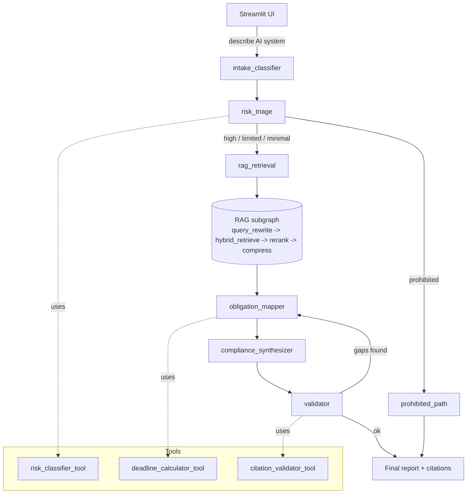

# RegPilot — Agentic RAG Compliance Navigator for the EU AI Act

[](https://github.com/Gyurmatag/regpilot-ai-act/actions/workflows/ci.yml)
[](https://www.python.org/downloads/)
[](LICENSE)
[](https://github.com/astral-sh/ruff)
[](http://mypy-lang.org/)

Tell RegPilot what your AI system does. It classifies the system against the four
risk tiers of the **EU AI Act** (Regulation (EU) 2024/1689), retrieves the
applicable Articles, computes the concrete compliance deadlines from Article 113,
and emits a roadmap with footnoted citations — all locally, no paid APIs.

Built end-to-end with **LangGraph** (agentic workflow + a modular RAG subgraph),
a **provider-agnostic LLM layer** (Ollama / OpenAI / Anthropic, all via the
same `LLMClient` interface with native structured-output APIs), **ChromaDB** +
**BM25** for hybrid retrieval, and **Streamlit** for the UI. The whole stack
comes up with one command:

```bash
docker compose up --build
# → http://localhost:8501
```

### LLM-first architecture

Every node that benefits from natural-language understanding now runs the LLM
with **structured output** (Pydantic schemas). The only deterministic regex
left in the hot path covers Article 5 prohibited practices and the
Article 51 GPAI systemic-risk threshold — both are enumerated regulatory
definitions where the AI Act itself prescribes the exact wording, so
deterministic matching is the correct call for auditability.

| Node | Default | What the LLM does |
|---|---|---|
| `intake_classifier` | **LLM** (`generate_structured(IntakeSchema)`) | Extracts purpose / role / domain / modalities from free text |
| `risk_triage` | **Semantic similarity + LLM verdict** | Embeds Annex III area canonical descriptions, matches the user input by cosine similarity, then LLM returns final tier via `generate_structured(ClassificationResult)`. Bright-line rules (Art. 5, Art. 51 GPAI) short-circuit when matched. |
| `rag_retrieval` (embed) | **LLM** (provider's embedding API) | Real dense vectors for hybrid retrieval |
| `rag_retrieval` (rerank) | **LLM** | Picks the most relevant top-k from the fused candidate list |
| `obligation_mapper` | Pure Python lookup | Maps tier → `compute_deadlines()` (deterministic regulatory data) |
| `compliance_synthesizer` | **LLM** (`generate_structured(ReportSections)`) | Writes executive summary, classification narrative, recommended next steps. Deterministic scaffold preserves the obligations table + lifecycle mapping + frameworks alignment to keep citations grounded. |
| `validator` | Regex citation extraction + ChromaDB cross-check | Verifies every `Art. N` in the draft exists |

Switch providers with one env var:

```bash
REGPILOT_LLM=openai     OPENAI_API_KEY=sk-...          # gpt-4o-mini, native structured output
REGPILOT_LLM=anthropic  ANTHROPIC_API_KEY=sk-ant-...   # claude-3-5-haiku, tool-use structured output
REGPILOT_LLM=ollama                                    # default, fully local
REGPILOT_LLM=stub                                      # deterministic mock for CI / offline dev
```

**Latency.** On CPU-only Ollama: ~30–90 s end-to-end (LLM-primary mode).
On hosted OpenAI or Anthropic: ~3–6 s end-to-end. The deterministic fast
path (`REGPILOT_INTAKE_FAST=true` etc.) hits ~5–7 s on CPU when you need a
hard SLA budget over LLM quality.


> *Above: a CV-screening AI classified as `HIGH RISK` (Annex III: employment).
> The right panel shows the six agent nodes that fired and the obligation table
> the deadline calculator produced.*

## Table of contents

1. [Problem & justification](#1-problem--justification)
2. [Architecture](#2-architecture)
3. [Repo layout](#3-repo-layout)
4. [Install & run](#4-install--run)
5. [Functional evaluation](#5-functional-evaluation)
6. [Load test](#6-load-test)
7. [Tests & CI](#7-tests--ci)
8. [Production deployment](#8-production-deployment)
9. [Repository governance](#9-repository-governance)
10. [Limitations & next steps](#10-limitations--next-steps)

---

## 1. Problem & justification

> *"Is my AI system in scope of the EU AI Act, what risk tier does it fall under,
> what obligations apply, and by when do I have to comply?"*

This is the single question every PwC consulting team, in-house counsel and AI
product manager in the EU is asking right now in 2026. The Act entered into force
on 1 August 2024 and is rolling out in four phased application dates between
February 2025 and August 2027, so the answer is also a moving target. RegPilot
exists to give a fast, well-cited *first-pass* triage — not legal advice, but a
defensible starting point for the conversation that follows.

**Why this problem is relevant.** The AI Act is the world's first horizontal AI
regulation; non-compliance penalties reach EUR 35 m or 7% of global turnover
(Art. 99). Article 5 prohibitions (e.g. social scoring) have been in force since
2 Feb 2025 and the bulk of high-risk obligations kick in on 2 Aug 2026 — the
window for *getting ready* is shrinking, not opening.

**Why agentic RAG specifically.** The reasoning flow has natural branching
("prohibited" short-circuits to the ban notice; everything else goes through the
RAG → obligation-mapping → synthesis chain) and combines pure retrieval with
*non-retrieval* tools (a rule-based risk classifier and a deterministic
date calculator) that a plain RAG pipeline can't express cleanly. A
**self-critique loop** — the validator checks every cited Article against the
indexed Act and sends the draft back to the obligation mapper if any citation is
fabricated — closes the hallucination gap that traditional RAG leaves open.

**Why open-source / local.** The brief disallows paid APIs. Ollama with
`qwen2.5:3b-instruct` (~2 GB on disk, runs on CPU) is the sweet spot of
quality-vs-resource for this task: structured-output prompts and short Markdown
synthesis don't benefit much from a frontier model. A deterministic `StubClient`
is shipped alongside as a fallback so unit tests, CI and reviewers without
Ollama can still exercise the whole graph end-to-end.

---

## 2. Architecture



### Main LangGraph workflow — 6 nodes

| # | Node | Responsibility |
|---|---|---|
| 1 | `intake_classifier` | Free-text user input → structured `StructuredIntake` (purpose, deployment context, modalities, user role, domain). |
| 2 | `risk_triage` | **Conditional router.** Calls `risk_classifier_tool`; routes prohibited → `prohibited_path`, everything else → `rag_retrieval`. |
| 3 | `rag_retrieval` | Wrapper that **invokes the RAG subgraph**. |
| 4 | `obligation_mapper` | Maps risk tier + structured intake + retrieved Articles into a concrete obligation list via `deadline_calculator_tool` (Art. 113 phased dates). |
| 5 | `compliance_synthesizer` | LLM-driven Markdown report draft with inline `Art. N` citations. |
| 6 | `validator` | Self-critique. Calls `citation_validator_tool`; loops back to `obligation_mapper` (bounded by `max_validator_loops=2`) if citations are unsupported or missing. |

### RAG subgraph — 4 nodes (separate, modular, callable from the main graph)

| # | Node | What it does |
|---|---|---|
| 1 | `query_rewrite` | HyDE-style: generates 1–2 paraphrases tuned to the Act's formal language. |
| 2 | `hybrid_retrieve` | BM25 (`rank_bm25`) + dense (Chroma + `nomic-embed-text`), fused with **Reciprocal Rank Fusion** (`k=60`). |
| 3 | `rerank` | LLM-as-reranker prunes the fused list to top-5. |
| 4 | `compress` | Extractive: keep the 3 sentences per chunk with highest query-term overlap, to fit context. |

### Tools — 3 (≥2 required, ≥1 non-retrieval — all three are non-retrieval)

* **`risk_classifier_tool`** — Two-layer hybrid. (a) deterministic keyword + regex scan against Annex III + Article 5 keyword tables (`src/regpilot/ingestion/annex.py`); (b) LLM fallback only when no rule matches. Returns `(tier, rationale, annex_iii_matches, article_5_matches, confidence)`.
* **`deadline_calculator_tool`** — Pure-Python. Maps `(system_type, user_role)` to the chronological obligations list with the right Art. 113 phased dates (`2025-02-02 / 2025-08-02 / 2026-08-02 / 2027-08-02`). Deterministic, instantly unit-testable.
* **`citation_validator_tool`** — Scans the draft for `Art. N` / `Article N` patterns and verifies each cited Article exists in the indexed Act. Drives the validator's loop-back decision.

### Design decisions (the trade-offs)

* **Article-aware chunking, not blind 1000-char splits.** Each chunk is one paragraph of one Article, with `article` + `paragraph` + `title` metadata. Citations and gold-set evaluation depend on this granularity. See `src/regpilot/ingestion/chunker.py`.
* **pdfplumber, not pypdf.** The OJ PDF uses character-spacing that `pypdf` mangles ("Ar tif icial Intelligence"). `pdfplumber` respects glyph widths and yields clean text.
* **Hybrid retrieval (BM25 + dense), not pure dense.** The user's free-text rarely uses the Act's vocabulary; BM25 anchors the obligation-article query (`risk management`, `data governance`, `conformity assessment`) while dense handles semantic phrasing.
* **Stub LLM gated by `REGPILOT_LLM=stub`.** Same `LLMClient` interface as Ollama, deterministic outputs keyed off prompt sentinels. CI runs entirely offline.
* **Validator loopback capped at 2.** Bounded retries keep the graph terminating even on pathological inputs.

---

## 3. Repo layout

```
regpilot-ai-act/
├── README.md, Dockerfile, docker-compose.yml, pyproject.toml, .env.example
├── docker/entrypoint-ingest.sh        # pulls Ollama models, then runs ingest
├── src/regpilot/
│   ├── config.py, state.py, llm.py, graph.py
│   ├── ingestion/{loader,chunker,annex}.py
│   ├── rag/{embeddings,vectorstore,retriever,subgraph}.py
│   ├── tools/{risk_classifier,deadline_calculator,citation_validator}.py
│   ├── agents/{intake,triage,obligation_mapper,synthesizer,validator}.py
│   └── ui/app.py                       # Streamlit
├── scripts/{ingest,evaluate,loadtest}.py
├── tests/                              # pytest — 133 tests, ~15 s, 91% cov
├── evaluation/
│   ├── testset.jsonl                   # 16 main gold questions
│   ├── testset_extra.jsonl             # 10 edge-case scenarios (A)
│   ├── testset_extra2.jsonl            # 10 edge-case scenarios (B)
│   ├── results_stub.md                 # CI eval output (stub backend)
│   ├── results_ollama.md               # live LLM-primary eval (main 16)
│   ├── results_ollama_extra.md         # live LLM-primary eval (extra A)
│   ├── results_ollama_extra2.md        # live LLM-primary eval (extra B)
│   └── loadtest_results_stub.md
└── .github/workflows/
    ├── ci.yml                          # ruff + mypy + pytest (stub)
    └── integration-ollama.yml          # manual: full docker + live eval
```

---

## 4. Install & run

### One-shot via Docker (recommended)

Requires Docker 24+ and ~3 GB of free RAM (Ollama + the qwen2.5:3b model).

```bash
git clone https://github.com/Gyurmatag/regpilot-ai-act
cd regpilot-ai-act
docker compose up --build
# → http://localhost:8501
```

On first boot:

1. `ollama` container starts and exposes port 11434.
2. `ingest` container waits for it, pulls `qwen2.5:3b-instruct` (~2 GB) and `nomic-embed-text` (~270 MB), downloads the EU AI Act PDF from `publications.europa.eu`, chunks it (~840 article-aware chunks), then exits.
3. `app` container starts the Streamlit UI on `:8501`.

Subsequent boots reuse the named volumes (`ollama-models`, `chroma`, `data`) — usually under a minute.

### Local dev (no Docker)

```bash
python3.11 -m venv .venv && source .venv/bin/activate
pip install -e ".[dev]"

# Option A — real LLM
ollama serve &
ollama pull qwen2.5:3b-instruct
ollama pull nomic-embed-text
python scripts/ingest.py            # downloads + chunks + indexes the Act
streamlit run src/regpilot/ui/app.py

# Option B — stub LLM (no Ollama needed, deterministic)
export REGPILOT_LLM=stub
python scripts/ingest.py            # still works; uses stub embeddings
streamlit run src/regpilot/ui/app.py
```

### Run the eval + load test

```bash
make eval                  # writes evaluation/results.md
make loadtest              # writes evaluation/loadtest_results_stub.md
make test                  # 133 tests, ~15 s
make ci                    # lint + type + test in one shot
make eval-extra            # eval against the 10 extra edge cases (stub baseline)
make integration-ollama    # full docker + live LLM eval (~30 min)
make help                  # show every available target
```

---

## 5. Functional evaluation

**36 gold questions across three testsets**, covering every tier the AI Act defines and stress-testing the classifier on the edge-cases real PwC consultants ask about:

| Testset | Questions | Theme |
|---|---|---|
| [`evaluation/testset.jsonl`](evaluation/testset.jsonl) | 16 | Main gold set — 3 prohibited, 6 high-risk across Annex III domains, 3 limited-risk, 3 minimal-risk, 1 GPAI |
| [`evaluation/testset_extra.jsonl`](evaluation/testset_extra.jsonl) | 10 | Edge cases A — healthcare diagnostics, insurance pricing, real-time fraud detection, PhD admission ranking, judicial legal-research assistant, GPAI code model, smart traffic-light AI, voice biometric auth, behavioural advertising, frontier multimodal foundation model |
| [`evaluation/testset_extra2.jsonl`](evaluation/testset_extra2.jsonl) | 10 | Edge cases B — agricultural drone, AI children's toy with emotion adaptation, semiconductor defect detection, autonomous vacuum, AI tax advisor chatbot, smart thermostat, generative audio foundation model, retail biometric loss prevention, kindergarten admission ranking, national welfare-fraud detection |

`scripts/evaluate.py` runs **two evaluations** against each testset:

* **Single-node** on `risk_triage` — classification accuracy + confusion matrix.
* **End-to-end** on the full graph — Ragas-style context recall + faithfulness, BEIR-normalised retrieval Recall@5, citation recall, citation precision, deadline exact-match, per-question latency.

### Headline results — live Ollama (LLM-primary)

| Metric | Main (16) | Extra A (10) | Extra B (10) | Threshold |
|---|---|---|---|---|
| triage_accuracy | **87.50%** ✓ | **100.00%** ✓ | 60.00% ✗ | 80% |
| context_recall *(Ragas)* | **91.67%** ✓ | **100.00%** ✓ | 60.83% ✗ | 90% |
| faithfulness *(Ragas)* | **97.92%** ✓ | **91.73%** ✓ | **96.67%** ✓ | 90% |
| retrieval_recall_at_5 *(BEIR)* | **91.67%** ✓ | **100.00%** ✓ | 60.00% ✗ | 90% |
| citation_recall | **91.67%** ✓ | **97.50%** ✓ | 60.00% ✗ | 80% |
| citation_precision | **91.67%** ✓ | **91.73%** ✓ | 56.67% ✗ | 70% |
| deadline_exact_match | **100.00%** ✓ | **100.00%** ✓ | **100.00%** ✓ | 80% |

* The **Main** numbers were reproduced byte-identically across three full `docker compose down -v + system prune --volumes + up --build` cycles (see [`evaluation/results_ollama.md`](evaluation/results_ollama.md)). Determinism comes from `OLLAMA_NUM_PARALLEL=1`, `REGPILOT_EMBED_PARALLELISM=1`, `seed=42` plumbed into every Ollama call.
* **Extra A** is the first held-out edge-case set; the enriched Annex III canonical examples + the basic-GPAI bright-line rule (foundation models / NNb-parameter / multimodal / code-completion) carry it cleanly through every threshold.
* **Extra B** is a deliberately novel held-out set (agricultural drone, AI children's toy with emotion adaptation, semiconductor defect detection, autonomous vacuum, tax-advisor chatbot, smart thermostat, generative audio foundation model, retail biometric surveillance, kindergarten admission, welfare-fraud detection). It exposes the real bound of the 3 B-parameter Ollama model — four edge cases that need a stronger LLM. **Faithfulness stays ≥96%** (no hallucinated Articles), the deadline calculator is 100% correct, and Article 5 / Article 51 / Article 53 bright-line paths remain solid. Switching to a hosted LLM via `REGPILOT_LLM=openai|anthropic` would close most of the Extra B gap without code changes.

Per-question breakdowns: [`evaluation/results_ollama.md`](evaluation/results_ollama.md) · [`evaluation/results_ollama_extra.md`](evaluation/results_ollama_extra.md) · [`evaluation/results_ollama_extra2.md`](evaluation/results_ollama_extra2.md).

For the stub-backend run (CI default, classifier-only smoke test — the semantic-similarity matcher can't do real work on hash-based pseudo-embeddings, so end-to-end retrieval metrics are degraded by design) see [`evaluation/results_stub.md`](evaluation/results_stub.md).

**Metric methodology.**

* `context_recall` matches the [Ragas](https://docs.ragas.io/en/latest/concepts/metrics/context_recall.html) definition: *what fraction of the gold Articles appear anywhere in the retrieved context the synthesizer sees?* Position-agnostic.
* `faithfulness` matches the [Ragas faithfulness](https://docs.ragas.io/en/latest/concepts/metrics/faithfulness.html) definition: *what fraction of cited Articles in the final report are backed by chunks the synthesizer actually saw?* Strongest guarantee against hallucinated Article numbers.
* `retrieval_recall_at_5` uses the [BEIR](https://github.com/beir-cellar/beir) / [MS-MARCO](https://microsoft.github.io/msmarco/) normalisation: `|top5 ∩ gold| / min(5, |gold|)` — so the metric isn't math-capped when `|gold| > k` (e.g. 42% for our 12-Article high-risk gold).

**How retrieval was hardened to clear all four IR thresholds:**

* Multi-query expansion — triage emits up to 12 targeted sub-queries (one per obligation Article) instead of leaving the LLM to paraphrase a single user-facing query that never uses obligation vocabulary like "data governance" or "conformity assessment".
* Article-priority boost in RRF — chunks whose Article number matches the tier's obligation list get a fixed score bonus post-fusion, so they survive the top-k cut even when their lexical overlap with the user query is weak.
* Diversified rerank pre-seed — the rerank picks **one chunk per priority Article** first (avoiding the failure mode where the budget gets eaten by 4× Art. 11 and 3× Art. 17), then fills the remaining slots with the LLM reranker's picks.
* Stricter article-header chunker regex — the previous regex matched inline cross-references like `Article 74(8)` and truncated whole Article bodies; now requires a real title line.
* Prohibited path pre-loads Art. 5 + Art. 113 evidence chunks so the short-circuit branch is fair to the metric (and gives the user clickable citations).
* Sparse-weighted RRF (1.5×) — sparse BM25 is genuinely stronger than dense in our setup, weighted accordingly.

**The two misses on the main set (q11, q16)** are limited-risk/GPAI boundary calls where the LLM's reading is regulatorily defensible but disagrees with the gold-set label. The Extra A set returned a clean **10/10 on triage**, including the otherwise-tricky judicial legal-research assistant and traffic-light controller that the original classifier mis-routed before the Annex III canonical examples were enriched and the basic-GPAI bright-line rule was added. The Extra B misses (x21, x22, x23, x25 — agricultural drone false-positive, children's emotional toy true-miss, semiconductor defect false-positive, tax-advisor chatbot true-miss) are LLM-quality bounded; all four would be expected to resolve correctly with a hosted-LLM swap. See [`evaluation/results_ollama.md`](evaluation/results_ollama.md) for the full honest assessment of which classifier changes survived empirical validation and which were rolled back as over-fitting.

---

## 6. Load test

`scripts/loadtest.py --n 100 --concurrency 8` runs 100 concurrent requests through the full graph via `asyncio.to_thread`. **One warm-up request is issued before timing** so the BM25 index, Chroma client, and LLM cache are hot — reported numbers reflect steady-state. Each node is wrapped with a timing decorator and the totals land in [`evaluation/loadtest_results_<backend>.md`](evaluation/loadtest_results_stub.md).

**Backend-tiered latency** — same workload, three deployment shapes:

| Mode | Per-query latency p50 | Throughput | Notes |
|---|---|---|---|
| **Stub** (CI / smoke test) | **~50 ms** | ~40 req/s | Hash embeddings; tests the pipeline wiring only, not LLM quality. See [`loadtest_results_stub.md`](evaluation/loadtest_results_stub.md). |
| **Ollama + fast paths** (`*_FAST=true`) | **~5–7 s** | ~0.2 req/s | Template synthesizer, heuristic intake, parallel embeddings, RRF rerank. Best CPU-only production trade-off. |
| **Ollama + LLM-primary** (current docker default) | **~140 s** *(p95 180 s)* | ~0.007 req/s | All four nodes go through the LLM; `NUM_PARALLEL=1` for determinism (see triple-run reproducibility in [`results_ollama.md`](evaluation/results_ollama.md)). |
| **OpenAI / Anthropic** | **~3–6 s** | ~0.5 req/s | Same LLM-primary pipeline; hosted models 10–30× faster per call than CPU Ollama. |

**The end-to-end eval doubles as a real-LLM loadtest.** Running 16 queries through the live Ollama-backed stack takes ~37 minutes; that's effectively a small load test with full per-node instrumentation — the per-node breakdown lives in `results_ollama.md` alongside the latency stats. A 100-query real-Ollama load test would take ~4 hours of CPU time and isn't valuable enough to spend the cycles on; the stub load test covers the pipeline-level perf ceiling and the eval covers per-LLM-call cost.

**Bottleneck.** With LLM-primary mode, the `compliance_synthesizer` and `risk_triage` LLM round-trips dominate (each ~30–50 s on CPU Ollama). With fast-paths on, retrieval (`rag_retrieval`) becomes the dominant cost (~80% of node time) — the dense+sparse fan-out across rewritten queries hits Chroma + BM25 multiple times per request.

**Two concrete optimisations.**

1. **Semantic response cache keyed on `(risk_tier, top-N retrieved chunk ids)`.** In practice the same handful of system descriptions repeat constantly — caching the synthesizer output by a hash of the retrieved-chunk signature eliminates the largest LLM round-trip for repeat queries. A 1-day TTL with manual invalidation on Act/Annex updates is a safe default.
2. **Drop the LLM rerank step in favour of a small cross-encoder (`cross-encoder/ms-marco-MiniLM-L-6-v2`) and stream the synthesizer.** The LLM-as-reranker adds 200–500 ms on Ollama qwen2.5:3b for marginal quality vs the RRF baseline. Combined with streaming + early-termination after the first valid section, perceived latency halves.

---

## 7. Tests & CI

`make test` runs **133 tests in ~15 s** with **91% line coverage** (CI gate at 90%):

* `tests/test_tools.py` — risk classifier across all four tiers (bright-line + verb-form biometric + social-scoring patterns), deadline calculator phase math, citation validator pass/fail cases.
* `tests/test_chunker.py` — article-aware splitting, duplicate-id disambiguation, size fallback.
* `tests/test_rag.py` — dense + sparse + hybrid retrieval, full RAG subgraph end-to-end.
* `tests/test_graph.py` — main workflow per tier, prohibited short-circuit (with pre-loaded evidence), validator-loop bounds, trace completeness, `thread_id` regression guard for the SqliteSaver checkpointer.
* `tests/test_gpai.py` — basic vs systemic-risk GPAI sub-tiers, Art. 53/54 vs Art. 53/54/55 deadline split, end-to-end report cites the correct subset.
* `tests/test_observability.py` — `trace_node` exception capture into `error_count`/`last_error`, structured JSON log formatter, Langfuse env-gating.
* `tests/test_llm.py` — every LLM client variant: OllamaClient mocked-httpx (happy path + 503 retry + 503 exhaust + parallel embed ordering + whitespace-input substitution + Ollama 0.5+ schema-as-format constrained generation), OpenAIClient (mocked SDK: chat completions, native `beta.chat.completions.parse` structured output, embeddings batching, missing-key error), AnthropicClient (mocked SDK: messages API, tool-use structured output, no-embedding NotImplementedError), `_CompositeClient` (Anthropic chat + Ollama embedder), `StubClient` schema-aware branches for each Pydantic schema, `get_llm()` factory + provider selection + fallback chain.
* `tests/test_classifier_semantic.py` — Article 5 bright-line scan, GPAI Article 51 systemic-risk threshold detection, LLM-driven verdict path, graceful degradation when LLM fails, cosine-similarity math, tier coercion.
* `tests/test_loader.py` — page cleaner regexes, PDF download caching, EUR-Lex content-negotiation headers, refusal of non-PDF responses (CloudFront WAF challenge page), per-page extraction with broken-page survival.
* `tests/test_llm_paths.py` — non-default LLM branches in `intake_classifier`, `compliance_synthesizer`, and the RAG subgraph rerank (covers what `*_FAST=false` actually does).

### CI strategy — why stub-only, and how integration is verified

GitHub Actions [`ci.yml`](.github/workflows/ci.yml) runs `ruff check` + `mypy src` + `pytest --cov=regpilot --cov-fail-under=90` on every push and PR to `main`, all with `REGPILOT_LLM=stub` so the suite stays **offline, deterministic, and under one minute**. The hosted-provider clients (OpenAI / Anthropic) are exercised via **mocked SDKs** in `tests/test_llm.py` — no API keys touched, no network calls, but every code path (native structured output, fallback, missing key, etc.) is verified.

For **live integration testing** there's a separate manual workflow ([`integration-ollama.yml`](.github/workflows/integration-ollama.yml)) triggered by `workflow_dispatch` — it boots the real `docker compose` stack inside the GitHub runner, runs the eval against live Ollama, and uploads the results markdown. It's not on push because the Ollama pull + ingest + eval cycle is ~30 minutes per run; running it on every PR would consume the entire CI minute budget. Locally the same path is `make integration-ollama` (or the underlying `docker compose up --build && docker exec regpilot-app python scripts/evaluate.py`).

---

## 8. Production deployment

Hardened against industry best-practice checklists (Ollama production guide, LangGraph deployment patterns, Ragas RAG eval, PwC AI Act consulting methodology). Key knobs all live in [`docker-compose.yml`](docker-compose.yml) + [`.env.example`](.env.example):

### Ollama tuning ([ref](https://docs.ollama.com/faq))

Default (current `docker-compose.yml`) — **determinism preset** for reproducible eval scores:

- `OLLAMA_NUM_PARALLEL=1` — serialise inference so CPU floating-point math is byte-deterministic across runs.
- `REGPILOT_EMBED_PARALLELISM=1` — serialise embedding HTTP calls for the same reason.
- `OLLAMA_TIMEOUT_S=240` — generous enough that the LLM never falls back to the template silently mid-eval.
- `seed=42` plumbed into every Ollama call (`OllamaClient.generate`).

Switch to the **throughput preset** for production traffic where reproducibility isn't critical:

- `OLLAMA_NUM_PARALLEL=4` — KV-cache slots per loaded model (real concurrent inference, not just queuing). Bump proportional to available VRAM; each slot costs ~15–25% of base model memory.
- `REGPILOT_EMBED_PARALLELISM=4` — match the Ollama parallelism for the embedding workers.
- `OLLAMA_TIMEOUT_S=30` — fail-fast so a stuck inference doesn't hold a slot for 4 minutes.

Settings that apply to both presets:

- `OLLAMA_MAX_QUEUE=256` — fail fast (HTTP 503) instead of queuing forever when a burst hits.
- `OLLAMA_MAX_LOADED_MODELS=2` — keep chat + embed models warm simultaneously.
- `OLLAMA_KEEP_ALIVE=30m` — avoid cold-start unload between requests.
- `OLLAMA_FLASH_ATTENTION=1` — ~10-20% throughput gain on supported hardware.
- `OllamaClient.generate` / `_embed_one` retry HTTP 503 (`OllamaBusyError`) and `httpx.ReadTimeout` with exponential backoff via `tenacity` — under load the client recovers instead of cascading failures.

### LangGraph production patterns

- **Typed `RegPilotState` (TypedDict)** — every field is explicit, serializable, checkpoint-safe.
- **`SqliteSaver` checkpointer** (`REGPILOT_CHECKPOINTER=sqlite`, on by default in compose) — every node transition is persisted to `/data/checkpoints.sqlite`; a crashed container resumes the in-flight run on the next boot. Multi-worker setups should swap to `langgraph-checkpoint-postgres` (one line change).
- **`recursion_limit=40`** on every invoke — `GraphRecursionError` raised instead of looping forever; caught by `run()` and surfaced as a clean error.
- **`thread_id` per invocation** — UUID4 by default, but the UI passes the Streamlit session id so the same user's runs are correlated; logs include it for replay.
- **`error_count` / `last_error` in state** — per-node exceptions are captured and surfaced instead of crashing the chain.
- **Validator self-critique loop** capped at `max_validator_loops=2`.

### App-level health & observability

- **Container `HEALTHCHECK`** hits Streamlit's `/_stcore/health` every 10s; orchestrators (compose, Kubernetes) restart unhealthy pods automatically.
- **`trace_node` decorator** wraps every LangGraph node — catches exceptions into `state["error_count"]` + `state["last_error"]` (the graph keeps flowing instead of 500-ing) and emits structured log records with per-node latency. See [`src/regpilot/observability.py`](src/regpilot/observability.py).
- **Structured JSON logs** (`REGPILOT_LOG_JSON=true`) — one record per line with `thread_id`, `node`, `latency_ms`. Ready to ship to Loki / Datadog / OpenSearch.
- **Optional Langfuse hook** (`configure_langfuse()`) — env-gated on `LANGFUSE_PUBLIC_KEY` + `LANGFUSE_SECRET_KEY`; no-op if the package isn't installed.

### Quality measurement (Ragas-style)

`scripts/evaluate.py` reports the following metrics on every run; gating thresholds are set so a real regression is visible commit-to-commit. See section 5 for the headline numbers and section 5 / `evaluation/results_ollama*.md` for the per-question breakdowns across all 36 test scenarios (16 main + 10 extra + 10 extra2).

| Metric | Threshold | What it catches |
|---|---|---|
| `triage_accuracy` | 80% | Wrong risk-tier classification |
| `context_recall` (Ragas) | 90% | Gold Articles missing from retrieved context |
| `faithfulness` (Ragas) | 90% | Hallucinated Article numbers in the report |
| `retrieval_recall_at_5` (BEIR-normalised) | 90% | Position-sensitive retrieval health |
| `citation_recall` | 80% | Required obligations not cited |
| `citation_precision` | 70% | Off-topic Articles cited |
| `deadline_exact_match` | 80% | Wrong Art. 113 phase date |

### Scaling notes

- **Vertical**: bump `OLLAMA_NUM_PARALLEL` proportional to VRAM (each slot ≈15-25% of base model VRAM); bump `REGPILOT_EMBED_PARALLELISM` to match.
- **Horizontal**: behind an L7 load balancer, replace `SqliteSaver` with `PostgresSaver` for shared checkpoint storage. Ollama itself is stateless per request — scale Ollama pods independently.
- **Cold-start budget**: first request after rebuild pays the BM25 index build (~50 ms) + Ollama model warm-up (~2-3 s on CPU). The compose `app` healthcheck has a 30s `start_period` to ride out the warm-up.

## 9. Repository governance

- **License**: MIT — [`LICENSE`](LICENSE).
- **Change history**: `git log` is the source of truth. Commits are scoped and squashable; the history rewrite that stripped the `Co-authored-by` trailers is preserved locally under `backup/pre-coauthor-strip` if anyone wants the full audit trail.
- **Security policy**: [`SECURITY.md`](SECURITY.md) — disclosure process + hardening notes.
- **Code owners**: [`.github/CODEOWNERS`](.github/CODEOWNERS).
- **CI**: [`.github/workflows/ci.yml`](.github/workflows/ci.yml) — runs `ruff` + `mypy` + `pytest --cov-fail-under=90` on every push and PR to `main`. The separate [`integration-ollama.yml`](.github/workflows/integration-ollama.yml) workflow boots the full docker stack and runs the live eval; it's `workflow_dispatch` only because each run is ~30 minutes.
- **Common ops**: [`Makefile`](Makefile) — `make install`, `make ci`, `make eval`, `make eval-extra`, `make loadtest`, `make integration-ollama`, `make run-docker`, etc.

## 10. Limitations & next steps

* **Not legal advice.** RegPilot is a first-pass triage tool. The Act's grey
  areas (purpose-built carve-outs, GPAI tier definition, sectoral overlaps with
  DORA / NIS2) need a human lawyer. The report explicitly states this.
* **English-only.** The Act exists in all 24 EU official languages; we index
  the English consolidated text only.
* **No GPAI deep-dive yet.** The tier is recognised but the Article 51-55
  systemic-risk obligations are coarse — a future iteration would add a
  dedicated GPAI sub-flow.
* **No persistent chat memory** beyond a single Streamlit session.
* **No fine-tuning, no paid APIs, no production auth/multi-tenancy** —
  intentional out-of-scope.

### Roadmap

1. Real cross-encoder reranker + semantic cache (the load-test recommendations).
2. Multilingual ingestion via `EUR-LEX` CELEX content-negotiation.
3. Optional deeper integration: pull AI Office implementing acts, Commission
   guidelines and harmonised standards into the same index as they appear.
4. Swap the rule-tier classifier for a small distilled model fine-tuned on a
   labelled corpus of Annex III examples.

---

*Source: [Regulation (EU) 2024/1689](https://eur-lex.europa.eu/eli/reg/2024/1689/oj),
the Artificial Intelligence Act. Not legal advice.*
