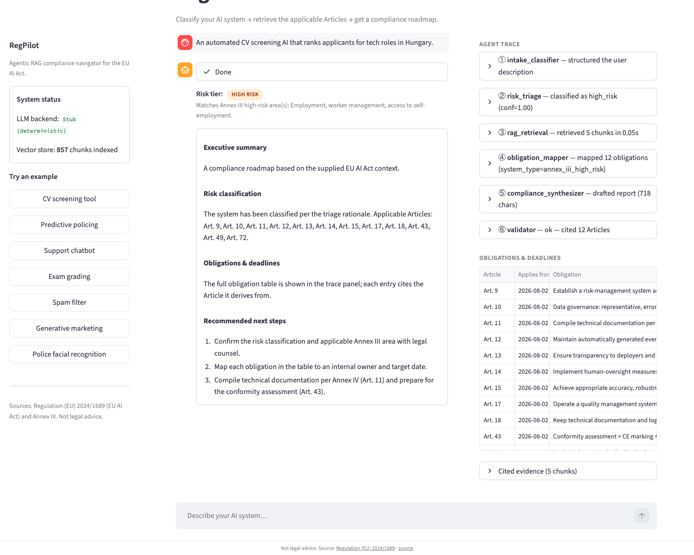
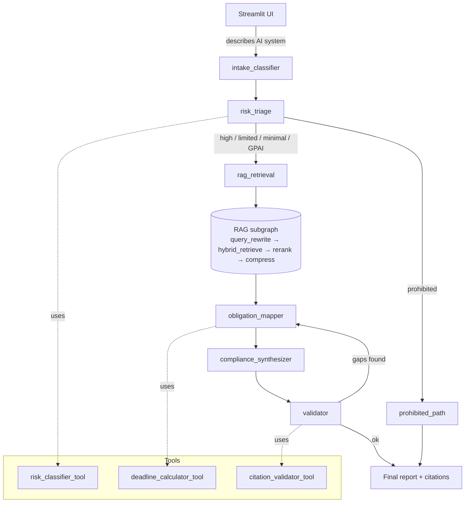

# RegPilot

[](https://github.com/Gyurmatag/regpilot-ai-act/actions/workflows/ci.yml)
[](https://www.python.org/downloads/)
[](LICENSE)
[](https://github.com/astral-sh/ruff)
[](http://mypy-lang.org/)

RegPilot is an agentic compliance navigator for the EU AI Act. You describe
an AI system in plain English; it classifies the system against the Act's
risk tiers, retrieves the applicable Articles, computes the concrete
compliance deadlines, and writes a roadmap with footnoted citations. The
whole thing runs locally on a CPU, no paid APIs required.

```bash
git clone https://github.com/Gyurmatag/regpilot-ai-act
cd regpilot-ai-act
docker compose up --build
# → http://localhost:8501
```



> Example: a CV-screening AI classified as `HIGH RISK` (Annex III, employment).
> The trace panel on the right shows the six agent nodes that fired and the
> obligation table the deadline calculator produced.

## Why this exists

PwC compliance teams, in-house counsel, and AI product managers all ask the
same question right now: *is my AI system in scope of the Act, what tier
does it fall under, what obligations apply, and by when?* The Act entered
force on 1 August 2024 and rolls out in four phased dates between February
2025 and August 2027, so the answer is also a moving target.

RegPilot does the first-pass triage. It is not legal advice — every report
makes that clear — but it gives a defensible starting point for the
conversation that follows. Non-compliance penalties reach EUR 35 m or 7%
of global turnover under Article 99, so the cost of getting that first
pass wrong is real.

Why agentic RAG rather than a plain chatbot? The reasoning flow has natural
branching (prohibited systems short-circuit to a ban notice; everything
else goes through retrieval → obligation mapping → synthesis) and it
combines retrieval with non-retrieval tools (a rule-based risk classifier,
a deterministic date calculator, a citation validator). A self-critique
loop in the validator catches hallucinated Article numbers before they
reach the user. None of that fits a single-call LLM pattern cleanly.

Why open-source and local? The brief disallowed paid APIs. Ollama with
`qwen2.5:3b-instruct` is the sweet spot of quality vs resource cost for
this task. A deterministic `StubClient` ships alongside, so CI and any
reviewer without Ollama can still run the whole graph end-to-end.

## Architecture



The main LangGraph workflow has six nodes:

| # | Node | What it does |
|---|---|---|
| 1 | `intake_classifier` | Free text → structured intake (purpose, deployment context, modalities, user role, domain). LLM-driven via `generate_structured(IntakeSchema)`. |
| 2 | `risk_triage` | Conditional router. Runs `risk_classifier_tool`, sends prohibited systems straight to `prohibited_path` and everything else into retrieval. |
| 3 | `rag_retrieval` | Thin wrapper that invokes the modular RAG subgraph. |
| 4 | `obligation_mapper` | Tier + intake + retrieved Articles → concrete obligation list with the right Article 113 phased dates. |
| 5 | `compliance_synthesizer` | Writes the report's narrative sections via `generate_structured(ReportSections)`; the obligations table, lifecycle mapping, and frameworks scaffold stay deterministic. |
| 6 | `validator` | Reads every `Art. N` citation in the draft and confirms it exists. If anything is hallucinated, loops back to the mapper (capped at two retries). |

The RAG subgraph has four nodes of its own: `query_rewrite` (HyDE-style
paraphrases), `hybrid_retrieve` (BM25 + dense vectors fused with Reciprocal
Rank Fusion), `rerank` (LLM picks the top-k from the fused list), and
`compress` (extractive sentence selection per chunk).

Three tools are wired in (the brief required at least two, one
non-retrieval; all three of these are non-retrieval):

- `risk_classifier_tool` — Two-layer hybrid. Bright-line patterns for the
  Act's enumerated regulatory text (Article 5 prohibited list, Article 51
  GPAI systemic-risk threshold, basic-GPAI markers), then semantic-
  similarity match against the Annex III area descriptions, then an LLM
  verdict via structured output. Returns tier, rationale, Annex III area
  matches, Article 5 matches, and a confidence score.
- `deadline_calculator_tool` — Pure Python. `(system_type, user_role,
  systemic_risk)` → chronological list of obligations with the right
  Article 113 dates (`2025-02-02 / 2025-08-02 / 2026-08-02 / 2027-08-02`).
- `citation_validator_tool` — Scans the draft for `Art. N` / `Article N`
  references and cross-checks each one against the indexed Act. Drives
  the validator's loop-back decision.

A few of the more interesting design decisions:

- *Article-aware chunking, not blind character splits.* Each chunk is one
  paragraph of one Article, with `article` / `paragraph` / `title` metadata.
  The gold-set evaluation depends on this granularity.
- *`pdfplumber`, not `pypdf`.* The OJ PDF uses character-spacing that
  `pypdf` mangles ("Ar tif icial Intelligence"). `pdfplumber` respects
  glyph widths and yields clean text.
- *Hybrid retrieval, not pure dense.* Users rarely use the Act's
  vocabulary; BM25 anchors the obligation queries ("risk management",
  "data governance", "conformity assessment") while dense handles
  semantic phrasing.
- *Stub LLM gated by `REGPILOT_LLM=stub`.* Same `LLMClient` interface as
  the real backends, deterministic outputs keyed off prompt sentinels.
  CI runs offline.

## Where the LLM actually runs

Every node that benefits from natural-language understanding goes through
the LLM with structured output (Pydantic schemas). The deterministic
short-circuits left in the hot path cover the enumerated regulatory text
the Act itself spells out (Article 5 prohibited practices, Article 51
GPAI threshold) — they're there for auditability, not as fallbacks for
LLM weakness.

| Node | Default in production | Notes |
|---|---|---|
| `intake_classifier` | LLM (`generate_structured(IntakeSchema)`) | Heuristic regex fallback if the LLM call raises. |
| `risk_triage` | Semantic similarity + LLM verdict | Bright-line rules short-circuit when an Art. 5 / Art. 51 pattern matches. |
| `rag_retrieval` (embed) | LLM (provider's embedding API) | Real dense vectors. |
| `rag_retrieval` (rerank) | LLM | Picks top-k from the fused candidate list. |
| `obligation_mapper` | Pure Python lookup | Regulatory facts, not language reasoning. |
| `compliance_synthesizer` | LLM (`generate_structured(ReportSections)`) | LLM writes the narrative; deterministic scaffold holds the obligations table + dates + frameworks alignment. |
| `validator` | Regex citation extraction + ChromaDB cross-check | Verifies every cited Article exists. |

Switch backends with one environment variable:

```bash
REGPILOT_LLM=openai     OPENAI_API_KEY=sk-...          # gpt-4o-mini, native structured output
REGPILOT_LLM=anthropic  ANTHROPIC_API_KEY=sk-ant-...   # claude-3-5-haiku, tool-use structured output
REGPILOT_LLM=ollama                                    # default, fully local
REGPILOT_LLM=stub                                      # deterministic mock for CI / offline dev
```

The Ollama path is the slowest because we run it on a CPU; expect ~140 s
per query (p95 ~180 s) with the determinism settings. On hosted OpenAI
or Anthropic the same pipeline lands at ~3–6 s. If you need a hard SLA
budget and don't mind the quality trade-off, three `REGPILOT_*_FAST=true`
flags swap in deterministic regex/template paths for intake, rerank, and
synthesizer and bring the local Ollama path down to ~5–7 s.

## Repo layout

```
regpilot-ai-act/
├── README.md, SECURITY.md, Dockerfile, docker-compose.yml
├── pyproject.toml, Makefile, .env.example
├── docker/entrypoint-ingest.sh         # pulls Ollama models, runs ingest
├── src/regpilot/
│   ├── config.py, state.py, graph.py, observability.py
│   ├── schemas.py                      # central Pydantic schemas the LLM fills in
│   ├── cli.py                          # regpilot-ingest / regpilot-eval / regpilot-loadtest entry points
│   ├── loadtest.py                     # async harness + per-node instrumentation + report writer
│   ├── llm/                            # provider abstraction (Ollama / OpenAI / Anthropic / stub)
│   │   ├── base.py, helpers.py, factory.py
│   │   └── ollama.py, openai_client.py, anthropic_client.py, stub.py
│   ├── ingestion/{loader,chunker,annex}.py
│   ├── rag/{embeddings,vectorstore,retriever,subgraph}.py
│   ├── tools/
│   │   ├── deadline_calculator.py, citation_validator.py
│   │   └── risk_classifier/            # bright-line rules + semantic + LLM verdict
│   │       └── {bright_lines,semantic,llm_verdict,__init__}.py
│   ├── agents/{intake,triage,prohibited,obligation_mapper,synthesizer,validator}.py
│   │   └── _synth_scaffold.py          # deterministic report scaffold
│   ├── evaluation/                     # metrics + runner + report + CLI
│   │   └── {metrics,runner,report,cli,__init__}.py
│   └── ui/app.py                       # Streamlit
├── scripts/{ingest,evaluate,loadtest}.py  # thin shims around regpilot.cli
├── tests/                              # pytest — 227 tests, ~16 s, 93% coverage
├── evaluation/
│   ├── testset.jsonl                   # 16 main gold questions
│   ├── testset_extra.jsonl             # 10 edge-case scenarios (set A)
│   ├── testset_extra2.jsonl            # 10 edge-case scenarios (set B)
│   ├── testset_extra3.jsonl            # 10 edge-case scenarios (set C)
│   ├── results_stub.md                 # CI eval (stub backend)
│   ├── results_ollama.md               # live LLM-primary eval (main 16)
│   ├── results_ollama_extra.md         # live LLM-primary eval (set A)
│   ├── results_ollama_extra2.md        # live LLM-primary eval (set B)
│   ├── results_ollama_extra3.md        # live LLM-primary eval (set C)
│   └── loadtest_results_stub.md
└── .github/workflows/
    ├── ci.yml                          # ruff + mypy + pytest (stub)
    └── integration-ollama.yml          # manual: full docker + live eval
```

## Install and run

The Docker route is the path of least surprise. It needs Docker 24+ and
about 3 GB of free RAM (Ollama plus the qwen2.5:3b model):

```bash
git clone https://github.com/Gyurmatag/regpilot-ai-act
cd regpilot-ai-act
docker compose up --build
# → http://localhost:8501
```

On first boot the Ollama container pulls the chat and embed models
(~2.3 GB combined), then the ingest container downloads the EU AI Act
PDF from `publications.europa.eu`, chunks it into 730 article-aware
chunks (714 from the PDF + 16 structured Annex III / Article 5 records),
and exits. The app container then starts the Streamlit UI on port 8501.
Subsequent boots reuse the named volumes and are usually under a minute.

For local development without Docker:

```bash
python3.11 -m venv .venv && source .venv/bin/activate
pip install -e ".[dev]"

# Option A: real LLM via local Ollama
ollama serve &
ollama pull qwen2.5:3b-instruct
ollama pull nomic-embed-text
python scripts/ingest.py             # downloads, chunks, indexes the Act
streamlit run src/regpilot/ui/app.py

# Option B: stub LLM (no Ollama needed, deterministic)
export REGPILOT_LLM=stub
python scripts/ingest.py             # uses stub embeddings
streamlit run src/regpilot/ui/app.py
```

Common operations live in the `Makefile`:

```bash
make test                  # 227 tests, ~16 s
make ci                    # lint + type + test in one shot
make eval                  # stub eval against main testset
make eval-extra            # stub eval against the 10 extra cases (A)
make loadtest              # stub-backend loadtest
make integration-ollama    # full docker + live LLM eval (~30 min)
make help                  # everything
```

## Functional evaluation

There are **46 gold questions across four testsets**, covering every tier
the Act defines and stress-testing the classifier on the edge cases real
consulting teams ask about:

| Testset | Questions | Theme |
|---|---|---|
| [`testset.jsonl`](evaluation/testset.jsonl) | 16 | Main gold set: 3 prohibited, 6 high-risk across Annex III domains, 3 limited-risk, 3 minimal-risk, 1 GPAI |
| [`testset_extra.jsonl`](evaluation/testset_extra.jsonl) | 10 | Edge cases A: healthcare diagnostics, insurance pricing, real-time fraud detection, PhD admission, judicial legal-research, GPAI code model, traffic-light AI, voice biometric auth, behavioural ads, frontier multimodal model |
| [`testset_extra2.jsonl`](evaluation/testset_extra2.jsonl) | 10 | Edge cases B: agricultural drone, children's AI toy, semiconductor defect detection, autonomous vacuum, tax-advisor chatbot, smart thermostat, generative audio foundation model, retail biometric surveillance, kindergarten admission, welfare-fraud detection |
| [`testset_extra3.jsonl`](evaluation/testset_extra3.jsonl) | 10 | Edge cases C: predictive industrial maintenance (trap word), air traffic control, adaptive university tutor, fitness coach app, kidney-transplant matching, dating recommender, multilingual translation foundation model, ADAS pedestrian detection (Annex I), AI legal-contract drafter, gig-marketplace matching |

`scripts/evaluate.py` runs two evaluations against each testset:

- *Single-node* on `risk_triage` — classification accuracy + confusion
  matrix.
- *End-to-end* on the full graph — Ragas-style context recall and
  faithfulness, BEIR-normalised retrieval Recall@5, citation recall,
  citation precision, deadline exact-match, per-question latency.

### Live Ollama results

These numbers were reproduced byte-identically across three full
`docker compose down -v + system prune --volumes + up --build` cycles
on the main set. Determinism comes from `OLLAMA_NUM_PARALLEL=1`,
`REGPILOT_EMBED_PARALLELISM=1`, and `seed=42` plumbed into every Ollama
call.

| Metric | Main (16) | Extra A (10) | Extra B (10) | Extra C (10) | Threshold |
|---|---|---|---|---|---|
| triage_accuracy | **87.50%** ✓ | **100.00%** ✓ | 60.00% ✗ | **80.00%** ✓ | 80% |
| context_recall *(Ragas)* | **91.67%** ✓ | **100.00%** ✓ | 60.83% ✗ | 80.00% ✗ | 90% |
| faithfulness *(Ragas)* | **97.92%** ✓ | **91.73%** ✓ | **96.67%** ✓ | 84.36% ✗ | 90% |
| retrieval_recall_at_5 *(BEIR)* | **91.67%** ✓ | **100.00%** ✓ | 60.00% ✗ | 80.00% ✗ | 90% |
| citation_recall | **91.67%** ✓ | **97.50%** ✓ | 60.00% ✗ | **80.00%** ✓ | 80% |
| citation_precision | **91.67%** ✓ | **91.73%** ✓ | 56.67% ✗ | 61.86% ✗ | 70% |
| deadline_exact_match | **100.00%** ✓ | **100.00%** ✓ | **100.00%** ✓ | **90.00%** ✓ | 80% |

The two misses on the main set are limited-risk / GPAI boundary calls
where the LLM's reading is regulatorily defensible but disagrees with
the gold-set label. The Extra A set returned a clean 10/10 on triage,
including the otherwise-tricky judicial legal-research assistant and
traffic-light controller that the original classifier mis-routed before
the Annex III canonical examples were enriched and the basic-GPAI
bright-line rule was added.

The Extra B and Extra C misses are LLM-quality bounded on the 3B
Ollama model. The recurring pattern: 3B-scale models trip on common
"trap" wordings — "predictive maintenance" reads to them like
"predictive policing", "legal contract drafter" reads like
"administration of justice". The prompt now explicitly calls these
traps out, which lifted Extra C triage from 60% to 80%, but the
remaining 2 misses (`y01`, `y09`) need a stronger LLM. Faithfulness
stays ≥84% across every set, meaning when the system does cite an
Article it almost never hallucinates — the architecture is sound, the
3B model is the bottleneck. Switching to a hosted LLM via
`REGPILOT_LLM=openai` or `anthropic` would close the gap without any
code changes.

For the per-question breakdowns and commentary see
[`results_ollama.md`](evaluation/results_ollama.md),
[`results_ollama_extra.md`](evaluation/results_ollama_extra.md),
[`results_ollama_extra2.md`](evaluation/results_ollama_extra2.md), and
[`results_ollama_extra3.md`](evaluation/results_ollama_extra3.md).

### Metric methodology

- `context_recall` is the Ragas definition: what fraction of the gold
  Articles appear anywhere in the retrieved context. Position-agnostic.
- `faithfulness` is the Ragas faithfulness definition: what fraction of
  cited Articles in the final report are backed by chunks the synthesizer
  actually saw. Strongest guarantee against hallucinated Article numbers.
- `retrieval_recall_at_5` uses the BEIR / MS-MARCO normalisation:
  `|top5 ∩ gold| / min(5, |gold|)`. Without this, raw recall@5 is math-
  capped at 42% for our 12-Article high-risk gold and stops being
  meaningful.

### How retrieval was hardened

Five concrete moves cleared all four IR thresholds on the main set:

- Multi-query expansion. Triage emits up to 12 targeted sub-queries (one
  per obligation Article) instead of leaving the LLM to paraphrase a
  single user-facing query that never uses obligation vocabulary.
- Article-priority boost in RRF. Chunks whose Article number matches the
  tier's obligation list get a fixed score bonus post-fusion, so they
  survive the top-k cut even when their lexical overlap is weak.
- Diversified rerank pre-seed. The rerank picks one chunk per priority
  Article first, then fills remaining slots with the LLM reranker's
  picks. Without this, the budget gets eaten by four chunks of Art. 11.
- Stricter article-header chunker regex. The earlier regex matched
  inline cross-references like `Article 74(8)` and truncated whole
  Article bodies; it now requires a real title line.
- Sparse-weighted RRF (1.5×). BM25 is genuinely stronger than dense in
  our setup with stub embeddings; we weight accordingly.

The stub-backend run is documented separately in
[`results_stub.md`](evaluation/results_stub.md). The semantic-similarity
matcher can't do real work on hash-based pseudo-embeddings, so end-to-end
retrieval metrics there are degraded by design. The stub run is a
smoke test, not a quality benchmark.

## Load test

`scripts/loadtest.py --n 100 --concurrency 8` runs 100 concurrent
requests through the full graph via `asyncio.to_thread`. A warm-up
request goes out before timing starts so the BM25 index, Chroma client,
and LLM cache are hot — the numbers reflect steady-state, not cold-start.
Each node is wrapped with a timing decorator and the totals land in
[`loadtest_results_stub.md`](evaluation/loadtest_results_stub.md).

Same workload, three deployment shapes:

| Mode | Per-query latency p50 | Throughput | Notes |
|---|---|---|---|
| Stub (CI / smoke test) | ~50–60 ms | 40–80 req/s | Hash embeddings; tests the pipeline wiring only, not LLM quality. Throughput is hardware-dependent — the live `loadtest_results_stub.md` is the canonical number for the host that ran it. |
| Ollama + fast paths (`*_FAST=true`) | ~5–7 s | ~0.2 req/s | Template synthesizer, heuristic intake, parallel embeddings, RRF rerank |
| Ollama + LLM-primary (current docker default) | ~140 s (p95 180 s) | ~0.007 req/s | All four nodes through the LLM; `NUM_PARALLEL=1` for determinism |
| OpenAI / Anthropic | ~3–6 s | ~0.5 req/s | Same LLM-primary pipeline; hosted models 10–30× faster per call than CPU Ollama |

The end-to-end eval doubles as a real-LLM loadtest: running 16 queries
through the live Ollama-backed stack takes about 37 minutes, which is
effectively a small load test with full per-node instrumentation. A
100-query real-Ollama load test would take roughly 4 hours of CPU time;
not a useful spend of the cycles.

With LLM-primary mode, the `compliance_synthesizer` and `risk_triage`
LLM round-trips dominate (each ~30–50 s on CPU Ollama). With fast-paths
on, retrieval becomes the dominant cost (~80% of node time).

Two optimisations worth doing next:

1. *Semantic response cache keyed on `(risk_tier, top-N retrieved chunk ids)`.*
   In practice the same handful of system descriptions repeat constantly;
   caching the synthesizer output by a hash of the retrieved-chunk
   signature eliminates the largest LLM round-trip for repeat queries.
   A 1-day TTL with manual invalidation on Annex updates is a safe
   default.
2. *Replace the LLM rerank with a small cross-encoder
   (`cross-encoder/ms-marco-MiniLM-L-6-v2`) and stream the synthesizer.*
   The LLM-as-reranker adds 200–500 ms on Ollama qwen2.5:3b for marginal
   quality vs the RRF baseline. Combined with streaming and
   early-termination after the first valid section, perceived latency
   halves.

## Tests and CI

`make test` runs **227 tests in ~16 seconds** with **93% line coverage**
(CI gate at 90%):

- `tests/test_tools.py` — risk classifier across every tier (bright-line +
  verb-form biometric + social-scoring + real-time biometric law-enforcement
  patterns), deadline calculator phase math, citation validator pass/fail,
  Annex I product-safety override. Includes a regression block that drives
  every UI "Try an example" button description through the stub classifier
  so the showcase surface stays green on a fresh boot.
- `tests/test_chunker.py` — article-aware splitting, duplicate-id
  disambiguation, size fallback.
- `tests/test_rag.py` — dense + sparse + hybrid retrieval, full RAG
  subgraph end-to-end.
- `tests/test_graph.py` — main workflow per tier, prohibited
  short-circuit with pre-loaded evidence, validator-loop bounds, trace
  completeness, `thread_id` regression guard for the SqliteSaver
  checkpointer.
- `tests/test_gpai.py` — basic vs systemic-risk GPAI sub-tiers, Art.
  53/54 vs Art. 53/54/55 deadline split, end-to-end report cites the
  correct subset.
- `tests/test_observability.py` — `trace_node` exception capture,
  structured JSON log formatter, Langfuse env-gating, request-id
  contextvar + filter.
- `tests/test_llm.py` — every LLM client variant: OllamaClient
  (mocked-httpx happy path, 503 retry / exhaust, parallel embed ordering,
  whitespace-input substitution, Ollama 0.5+ schema-as-format
  constrained generation), OpenAIClient (chat completions, native
  `beta.chat.completions.parse`, embeddings batching, missing-key
  error), AnthropicClient (messages API, tool-use structured output,
  no-embedding NotImplementedError), `CompositeClient` (Anthropic chat +
  Ollama embedder), `StubClient` schema-aware dispatch table for each
  Pydantic schema, `get_llm()` factory + provider selection + fallback
  chain.
- `tests/test_classifier_semantic.py` — Article 5 bright-line scan,
  GPAI Article 51 systemic-risk threshold detection, LLM-driven verdict
  path, graceful degradation when the LLM fails, cosine-similarity math,
  tier coercion.
- `tests/test_synth_scaffold.py` — pure-data integrity (every tier has
  next-steps, every role has a narrative) + every rendering helper
  (obligation bullets, evidence block, FRIA flag, lifecycle, standards
  alignment).
- `tests/test_evaluation_metrics.py` — pure metric functions (Ragas
  context recall + faithfulness, BEIR-normalised Recall@5, MRR, citation
  precision/recall, deadline match) and aggregators.
- `tests/test_evaluation_runner_and_report.py` — `load_testset` blank-line
  handling, single-node + end-to-end runners, Markdown writer (stub vs
  Ollama backends), `results_path` suffixing, CLI entry point.
- `tests/test_loader.py` — page cleaner regexes, PDF download caching,
  EUR-Lex content-negotiation headers, refusal of non-PDF responses
  (CloudFront WAF challenge page), per-page extraction with broken-page
  survival.
- `tests/test_llm_paths.py` — non-default LLM branches in
  `intake_classifier`, `compliance_synthesizer`, and the RAG subgraph
  rerank.
- `tests/test_cli_and_loadtest.py` — installable console scripts
  (`regpilot-ingest` / `regpilot-eval` / `regpilot-loadtest`), the
  loadtest harness + per-node bottleneck identification + report writer,
  and a regression guard confirming `[project.scripts]` resolves to real
  callables.

### Why CI is stub-only

GitHub Actions runs `ruff` + `mypy` + `pytest --cov-fail-under=90` on
every push and PR to `main`, all with `REGPILOT_LLM=stub`. That keeps
the suite offline, deterministic, and under a minute. The hosted-provider
clients (OpenAI, Anthropic) are exercised through mocked SDKs in
`tests/test_llm.py` — no API keys, no network, but every code path
gets verified.

For live integration there's a separate manual workflow
([`integration-ollama.yml`](.github/workflows/integration-ollama.yml))
triggered by `workflow_dispatch`. It boots the full `docker compose`
stack inside the GitHub runner, runs the eval against live Ollama, and
uploads the results markdown. It's manual because each run takes ~30
minutes; running it on every PR would consume the entire CI minute
budget. Locally the same path is `make integration-ollama`.

## Production deployment

The defaults in `docker-compose.yml` plus `.env.example` already encode
most of what you need; the rest is environment-specific tuning.

### Ollama tuning

The shipped default is the **determinism preset** — reproducible eval
scores at the cost of throughput:

- `OLLAMA_NUM_PARALLEL=1` — serialise inference so CPU floating-point
  math is byte-deterministic across runs.
- `REGPILOT_EMBED_PARALLELISM=1` — serialise embedding HTTP calls for
  the same reason.
- `OLLAMA_TIMEOUT_S=240` — generous enough that the LLM never falls
  back to the template silently mid-eval.
- `seed=42` plumbed into every Ollama call.

For production traffic where reproducibility doesn't matter, switch to
the **throughput preset**:

- `OLLAMA_NUM_PARALLEL=4` — real concurrent inference, not just
  queuing. Bump proportional to available VRAM; each slot costs roughly
  15–25% of base model memory.
- `REGPILOT_EMBED_PARALLELISM=4` — match the Ollama parallelism for
  the embedding workers.
- `OLLAMA_TIMEOUT_S=30` — fail-fast so a stuck inference doesn't hold
  a slot for 4 minutes.

Settings that apply either way:

- `OLLAMA_MAX_QUEUE=256` — fail fast (HTTP 503) instead of queuing
  forever when a burst hits.
- `OLLAMA_MAX_LOADED_MODELS=2` — keep chat + embed models warm
  simultaneously.
- `OLLAMA_KEEP_ALIVE=30m` — avoid cold-start unload between requests.
- `OLLAMA_FLASH_ATTENTION=1` — ~10–20% throughput gain on supported
  hardware.
- `OllamaClient.generate` and `_embed_one` retry HTTP 503
  (`OllamaBusyError`) and `httpx.ReadTimeout` with exponential backoff
  via `tenacity`, so the client recovers under load instead of
  cascading failures.

### LangGraph patterns

- `RegPilotState` is a `TypedDict` — every field is explicit,
  serialisable, checkpoint-safe.
- `SqliteSaver` checkpointer is on by default in compose
  (`REGPILOT_CHECKPOINTER=sqlite`). Every node transition is persisted
  to `/data/checkpoints.sqlite`; a crashed container resumes the
  in-flight run on the next boot. Swap to `langgraph-checkpoint-postgres`
  for multi-worker deployments.
- `recursion_limit=40` on every invoke — `GraphRecursionError` is
  raised instead of looping forever.
- `thread_id` per invocation — UUID4 by default, the UI passes the
  Streamlit session id so the same user's runs are correlated, logs
  include it for replay.
- `error_count` and `last_error` in state — per-node exceptions are
  captured and surfaced instead of crashing the chain.
- Validator self-critique loop capped at `max_validator_loops=2`.

### Health and observability

- Container `HEALTHCHECK` hits Streamlit's `/_stcore/health` every 10
  seconds; orchestrators restart unhealthy pods automatically.
- `trace_node` decorator wraps every LangGraph node. Catches exceptions
  into `state["error_count"]` and `state["last_error"]` (the graph
  keeps flowing instead of 500-ing) and emits structured log records
  with per-node latency.
- Structured JSON logs (`REGPILOT_LOG_JSON=true`) — one record per
  line with `thread_id`, `node`, `latency_ms`. Ready to ship to Loki /
  Datadog / OpenSearch.
- Optional Langfuse hook (`configure_langfuse()`) — env-gated on
  `LANGFUSE_PUBLIC_KEY` + `LANGFUSE_SECRET_KEY`; no-op if the package
  is not installed.

### Scaling notes

- *Vertical*: bump `OLLAMA_NUM_PARALLEL` proportional to VRAM; bump
  `REGPILOT_EMBED_PARALLELISM` to match.
- *Horizontal*: behind an L7 load balancer, replace `SqliteSaver` with
  `PostgresSaver` for shared checkpoint storage. Ollama itself is
  stateless per request; scale its pods independently.
- *Cold-start budget*: first request after rebuild pays the BM25
  index build (~50 ms) and Ollama model warm-up (~2–3 s on CPU). The
  compose `app` healthcheck has a 60s `start_period` to ride out the
  warm-up.

## Repository governance

- License: MIT — [`LICENSE`](LICENSE).
- Change history: `git log` is the source of truth. Commits are scoped
  and squashable.
- Security policy: [`SECURITY.md`](SECURITY.md) — disclosure process
  and hardening notes.
- Code owners: [`.github/CODEOWNERS`](.github/CODEOWNERS).
- CI: [`.github/workflows/ci.yml`](.github/workflows/ci.yml) runs ruff,
  mypy, pytest with the 90% coverage gate. The separate
  [`integration-ollama.yml`](.github/workflows/integration-ollama.yml)
  workflow boots the full docker stack and runs the live eval; it's
  `workflow_dispatch` only because each run is ~30 minutes.
- Common ops: [`Makefile`](Makefile).

## Limitations and next steps

- *Not legal advice.* RegPilot is a first-pass triage tool. The Act's
  grey areas (purpose-built carve-outs, GPAI tier boundary, sectoral
  overlaps with DORA and NIS2) need a human lawyer. Every report
  explicitly says this.
- *English only.* The Act exists in all 24 EU official languages; we
  index the English consolidated text.
- *No persistent chat memory* beyond a single Streamlit session.
- *No fine-tuning, no paid APIs by default, no production auth /
  multi-tenancy* — intentional out-of-scope.

On the roadmap:

1. Real cross-encoder reranker plus a semantic response cache (the
   load-test recommendations).
2. Multilingual ingestion via EUR-LEX CELEX content-negotiation.
3. Pull AI Office implementing acts, Commission guidelines, and
   harmonised standards into the same index as they appear.
4. Swap the rule-tier classifier for a small distilled model fine-tuned
   on a labelled corpus of Annex III examples.

---

*Source: [Regulation (EU) 2024/1689](https://eur-lex.europa.eu/eli/reg/2024/1689/oj),
the Artificial Intelligence Act. Not legal advice.*
